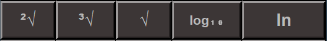
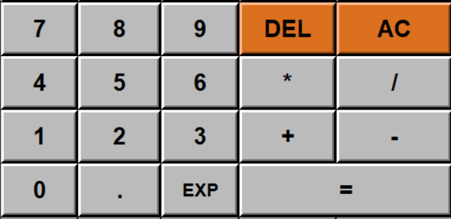

# Tkinter Calculator

### Scientific calculator using Python's library Tkinter 

   

#### Some explanations for each button and the function which represents are the following : 

- **1st Row**

   

  
1. **abs** : The absolute value of a number (e.g. abs(-5) = 5).
2. **mod** : From *modulo*. it's the operation to find the remainder of the division of one number by another.  
&nbsp; &nbsp; &nbsp; &nbsp; &nbsp; &nbsp;  In python we use the symbol %  (e.g. 5mod2 = 5%2 = 1).  
3. **div** : Floor division returns the result of the division rounded down to the nearest integer.  
&nbsp; &nbsp; &nbsp; &nbsp; &nbsp;  In python we use the symbol //  (e.g. 8div3 = 8//3 = 2).
4. **x!**  : The factorial of the number x (e.g. 4! = 24).
5. **e**   : The Euler's number. A mathematical constant approximately equal to 2.71828.  

- **2nd Row**

   

1. **sin** : Sine of an angle &theta; in degrees (e.g. sin(90)=1).
2. **cos** : Cosine of an angle &theta; in degrees (e.g. cos(180)=-1).
3. **tan** : Tangent of an angle &theta; in degrees (e.g. tan(45)=1).
4. **cot** : Cotangent of an angle &theta; in degrees (e.g. cot(45) = 1/tan(45) = 1).
5. **π** : Archimedes' constant defined as the ratio of a circle's circumference to its diameter.  
&nbsp; &nbsp; &nbsp; &nbsp;It is approximately equal to 3.14159.

- **3rd Row**

   

1. **x2** : x raised to the power of 2 (e.g. 42 = 16).
2. **x3** : x raised to the power of 3 (e.g. 53 = 125).
3. **xn** : x raised to any power (e.g. 24 = 16 ).
4. **x-1** : x raised to the power of (-1). The inverse of number x (e.g. 2-1 = 0.5).
5. **10x** : Powers of 10 (e.g. 103 = 1000).

- **4th Row**

   

1. **2√** : Square root of a number (e.g. 2√144 = 12).
2. **3√** : Cube root of a number (e.g. 3√8 = 2).
3. **√**  : Any root of a number (e.g. 4√16 = 2).
4. **log10** : The logarithm of a number with base 10 (e.g. log101000 = 3).
5. **ln** : The logarithm of a number with base e (e.g. logee = ln e = 1).

- **5th Row**

   

1. **(** : Left parenthesis.
2. **)** : Right parenthesis.
3. **±** : Change the sign of a number.
4. **%** : Find the percentage of a number (e.g. 5% = 0.05).
5. **log2** : The logarithm of a number with base 2.

- **6th,7th,8th,9th Row**

   

In these rows are :  

-> The basic number buttons (0 to 9).  
-> The basic math symbols (operators) (+, -, *, /).  
-> The equal sign (=) and point (.).  
-> Button **DEL** to delete one or more from the end of the entry.  
-> Button **AC** to delete the whole entry.  
-> **EXP** : Multiply any number with powers of 10 (e.g. 2 * 10 ** 3 = 2000).  

- **10th Row**

   

1. **fibo** : The nth fibonacci number.
2. **erf** : The error function erf(x) of a number x.
3. **ex** : Expotential function (e.g. e2=approx 7.389).
4. **gamma** : The gamma(x) function of a number x.
5. **lngamma** : The ln(gamma(x)) function of a number x.

- **11nd Row**

   

1. **sinh** : Hyperbolic sine of an angle &theta; in degrees.
2. **cosh** : Hyperbolic cosine of an angle &theta; in degrees.
3. **tanh** : Hyperbolic tangent of an angle &theta; in degrees.
4. **deg** :  Conversion of radians to degrees.
5. **rad** :  Conversion of degrees to radians.

- You can copy/paste numbers from/to the calculator.  
- For the factorial, trigonometic and logarithmic functions and functions of rows 10 and 11 you need to type or paste the number and then press the button.  
- For windows users with intel CPU machines you can download the GUI executable from the bin folder.  

## Authors
* **Konstantinos Thanos**
* **Olga Tsiouri**
